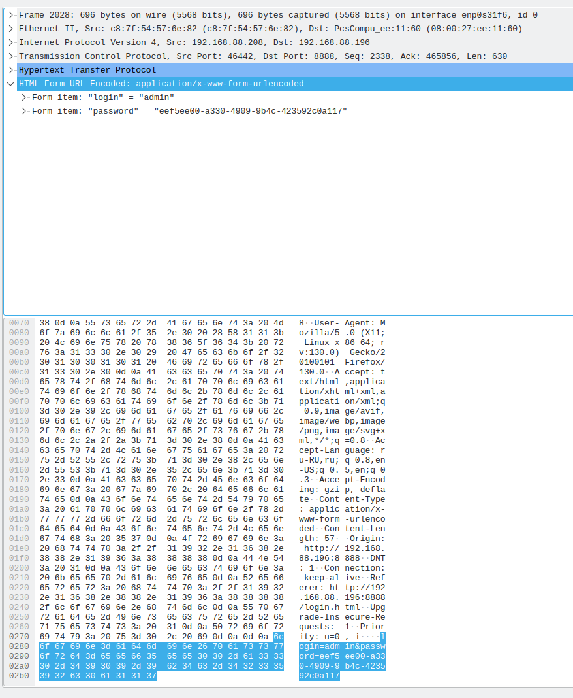
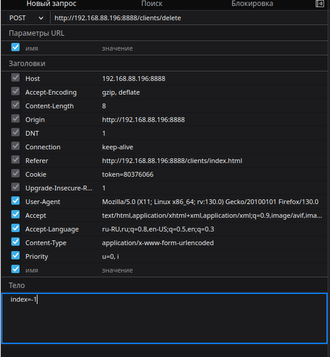
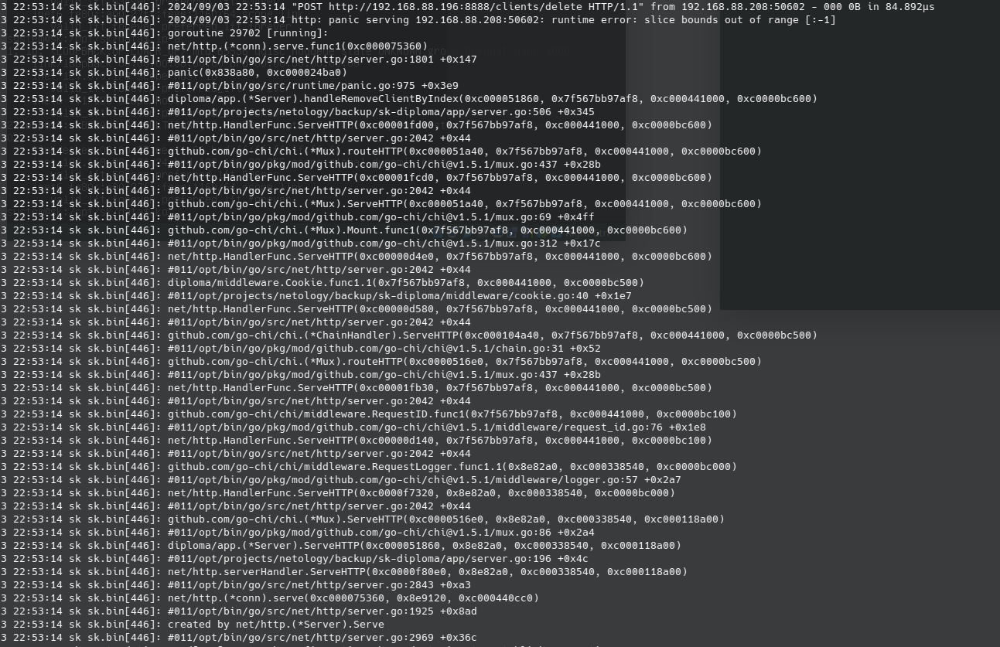
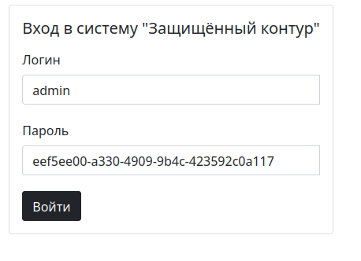
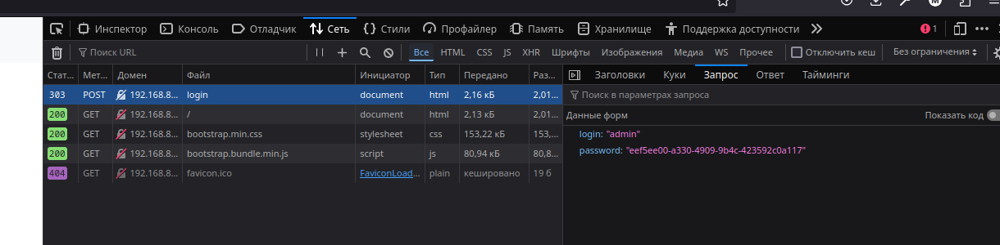
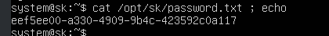

# Отчет по sk

## Расхождение по нормативной документации

### Идентификация и аутентификация субъектов доступа и объектов доступа (ИАФ)
|Условное обозначение и номер меры|Уровни защищенности персональных данных|
| ------------- | ------------- |
| ИАФ.1  | 4 |
| ИАФ.2  | нет |
| ИАФ.3  | 4 |
| ИАФ.4  | нет |
| ИАФ.5  | 4 |
| ИАФ.6  | 4 |

### Управление доступом субъектов доступа к объектам доступа (УПД)
|Условное обозначение и номер меры|Уровни защищенности персональных данных|
| ------------- | ------------- |
| УПД.1  | 4 |
| УПД.2  | 4 |
| УПД.3  | нет |
| УПД.4  | 4 |
| УПД.5  | 4 |
| УПД.6  | нет |
| УПД.7  | нет |
| УПД.8  | нет |
| УПД.9  | нет |
| УПД.10 | нет |
| УПД.11 | 4 |
| УПД.12 | нет |
| УПД.13 | нет |
| УПД.14 | нет |
| УПД.15 | нет |
| УПД.16 | нет |
| УПД.17 | нет |

### КТ: "разрешение или запрет доступа к информации, составляющей коммерческую тайну" посредством механизмов разграничения доступа, встроенных в приложение (механизмы ОС и сторонних сервисов рассматривать не нужно)
```
При создании пользователя с ролью только админ, появляется возможность читать персональные данные и ком. тайну, что не правильно, у админа не всегда есть разрешение на просмотр таких данных.

При входе под пользователем в среду есть возможность установки любого ПО

Отсутствует шифрация файлов представляющих ком. тайну.
```

## Уязвимости
### 1. уязвисомть Man-in-the-middle
```
Нет защищенного подключения, за счет чего пароль и логин легко обнаружить например при помощи wireshark. 
```

```
Как найти логин и пароль:
1. Запускаем wireshark
```
```
2. Фильтруем по протоколу и находим интерестную строчку post запроса на эндпоинт /login
```


```
3. Раскрываем ее и просматриваем строки, находим пароль
```


```
Таким же образом можно увидеть все операции на странице, включая добавление записей в бд и отображение данных на странице, как минимум необходимо добавить tls и отключить подключение по http, сделав его только по https
```

### 2. уязвисомть out of range
```
Нет защиты от out of range. Получилось "положить" сервер.
```
```
Как получилось:
1. Запускаем консоль firefox, открываем сеть, жмем кнопку удаления (например на форме Клиенты) и получаем энпоинт /clients/delete;
2. Переходим на форму: "отправить повторно" и ставим index=-1;
```


```
3. Отправляем запрос, серер больше не может возвращать ответы при попытках запроса.
```

```
для защиты, нужно валидировать данные на стороне бекэнда, как минимум для данного примера на языке Go использовать тип uint, в данном случае сервер вернет 500 на запрос, а не упадет.
```

### *Скрытие паролей
```
Отмечу что пароли не шифруются и не маскируются, примеры ниже:
```



